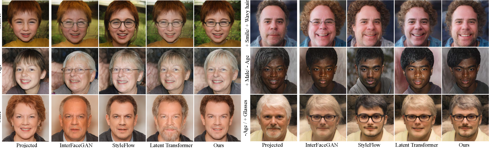
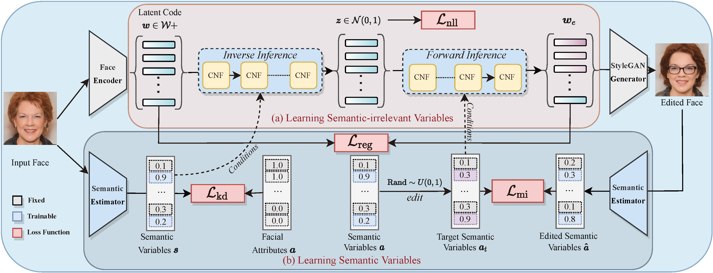

# SDFlow

Official code for `Semantic Latent Decomposition with Normalizing Flows for Face Editing`, https://arxiv.org/abs/2309.05314

> In recent years, navigating in the latent space of StyleGAN has achieved significant progress for face editing. However, these methods usually encounter challenges in complicated navigation due to the entanglement between different attributes in the latent space of StyleGAN. This paper proposes a novel framework, termed SDFlow, with a semantic decomposition in original latent space using continuous conditional normalizing flows. Specifically, SDFlow decomposes the original latent code into different irrelevant variables by jointly optimizing two components: (i) a semantic estimator produces semantic variables from input faces and (ii) a flow-based transformation module maps the latent code to semantic-irrelevant variable in Gaussian distribution, conditioned on the learned semantic variables. To eliminate the entanglement between variables, we further employ a disentangled learning strategy under a mutual information framework, thereby providing precise manipulation controls. Experimental results demonstrate that SDFlow outperforms existing face editing methods both qualitatively and quantitatively.

> ***Index terms*** : Face Editing, Disentangle Learning, Generative Adversarial Network

**If you found this code helps your work, do not hesitate to cite my paper or star this repo!**

   

**Open in colab** [](https://colab.research.google.com/github/phil329/SDFlow/blob/main/SDFlow_playground.ipynb)

**Example results**



**Framework**


## Installation

Clone this repo.

```bash
git clone https://github.com/phil329/SDFlow.git
cd SDFlow/
pip install -r requirements.txt
```

## Training and Evaluation

**Requirements**: PyTorch, streamlit, pillow, opencv-python, tqdm. You can install them by
`pip install -r requirements.txt`

**Training data**: Download the datasets [FFHQ](https://github.com/NVlabs/ffhq-dataset) and [CelebA](https://mmlab.ie.cuhk.edu.hk/projects/CelebA.html). The age labels of FFHQ come from [here](https://github.com/royorel/Lifespan_Age_Transformation_Synthesis/tree/master), and can be downloaded from our links below. CelebA should be aligned like FFHQ, see https://github.com/NVlabs/ffhq-dataset/blob/master/download_ffhq.py

**Training**: We provide the training code in `training`.

`training/train_sdflow.py` trains the whole SDFlow model. The parameters are described in the code.
`training/train.sh` provides some example scripts:

```sh

CUDA_VISIBLE_DEVICES=X python train_sdflow.py --attribute_index 15 20 39 

CUDA_VISIBLE_DEVICES=X python train_sdflow.py --attribute_index 15 20 31 33 39 
```

**Playground**: `SDFlow_playground.ipynb` shows the usage of SDFlow. You can play with the pretrained models and edit the faces in the latent space.

## Pre-trained models

The pre-trained models can be downloaded at:

* Google Drive: https://drive.google.com/drive/folders/1bOObaXE-zY_7-pXNyuTnhKvkn1wCqkaT?usp=sharing
* Baidu Disk: https://pan.baidu.com/s/144ntMeT6sByLde8P6GUGlQ  passwd : phil

Download all needed models and ffhq data, and put them into `data/`.

The models' weights include:

- Attribute estimator in `data/ckpt/`
- Flow-based transformer `data/ckpt/`
- Attribute classifier (Resnet34);
- Face Alignment, E4E encoder, and official StyleGAN2 model
- All train latent codes and predictions of FFHQ datasets (Do not download if you do not train your own model).

## Demo

**Open in colab** [](https://colab.research.google.com/github/phil329/SDFlow/blob/main/SDFlow_playground.ipynb)

or run the demo locally. The web ui demo looks like this:


If all models are downloaded, just run:

```sh
streamlit run app.py
```

We additionally support

- (1) Align the faces to FFHQ template
- (2) Project the input images into $W+$ space for in-the-wild editing
- (3) Showing the facial attributes by the pretrained classifier.

Note that image with large size may cost most in the face alignment process. We recommend to resize the input image to 256x256 before uploading.

Due to the limitation, we only provide the demo of editing single attribute. You can edit multiple attributes by slightly modifying the code in the notebook `SDFlow_playground.ipynb` locally.

## Citation

**We appreciate for any citations or stars if you found this work is helpful**


```bibtex
@inproceedings{blli2023semantic,
  title={Semantic Latent Decomposition with Normalizing Flows for Face Editing},
  author={Li, Binglei and Huang, Zhizhong and Shan, Hongming and Zhang, Junping},
  journal={arXiv preprint arXiv:2309.05314},
  year={2023}
}
```

## Acknowledgments

This implementation builds upon the awesome work done by Zhizhong Huang et al. (**[AdaTrans](https://github.com/Hzzone/AdaTrans)**), Karras et al. (**[StyleGAN2](https://github.com/NVlabs/stylegan2)**) and Chen et al. (**[torchdiffeq](https://github.com/rtqichen/torchdiffeq)**).  They provides inspiration and examples that played a crucial role in the implements of this project.
